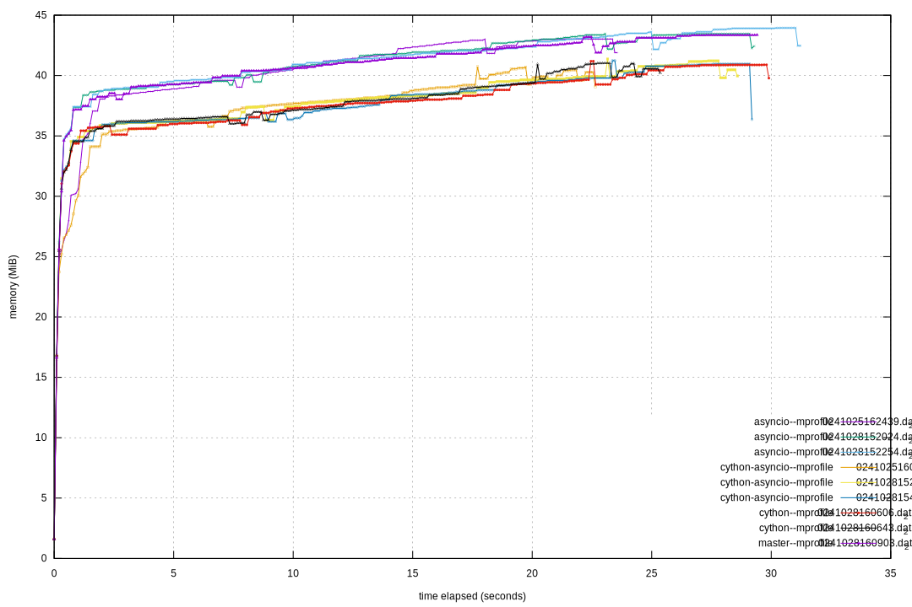

Compiling the Steam API test with Cython
========================================

Process
-------

Cython is capable of compiling unmodified python, but with relatively little
speedup, as it would mostly just be calling into libpython. There are two
dialects which cython accepts: pure python, which uses type annotations and
can be processed (with no performance, but maybe some typographic benefits)
by any normal python interpreter such as CPython, and 'cdef cython', which
is a superset of python that is not backwards-compatible in source form. The
benefits of the former are obvious, and I [initially attempted][pp port] to
port to that, but found that its implementation is incomplete (cython
development has historically been fraught, though it's far more stable and
less buggy as of 3.0), and in practice there were inconsistencies even with
the expected incomplete behaviour: types such as `bint` and `size_t` were
inaccessible, and `cimport` was buggy. `enum` and `const` are not implemented
in pure-python-compatible cython, and `ctypedef`'s equivalent is unclear.
Additionally, the meeting of the mandatory enforcement of C types and
the optional python annotations doesn't seem very well-defined, and some
type inconsistencies could be ignored rather than raise errors at build-
or run-time.

[pp port]: https://github.com/el-remph/hertzian-steam-tech-test/commit/b2ddcac

After porting to 'cdef cython', I made two further changes to the program
logic itself:

- remove jsonschema use in [a rather ugly merge], as it was rendered redundant
  by cython's type enforcement, which checks expectations of input values *and*
  optimises for those types. Eliminating a whole python module, and a
  computationally intensive part of the process, led to a substantial speedup
- [Alter the sort algorithm][sort changes] to something more appropriate for C,
  with more use of C integral types (which have close to no cost) rather than
  manipulating python lists. It was optimised further [here][sort optimisation]

[a rather ugly merge]: https://github.com/el-remph/hertzian-steam-tech-test/commit/a51ab6a
[sort changes]: https://github.com/el-remph/hertzian-steam-tech-test/commit/569a50d
[sort optimisation]: https://github.com/el-remph/hertzian-steam-tech-test/commit/f26dddc

### Lessons ###

The port itself (just adding types) was relatively easy. There were some
non-obvious considerations:

- Cython doesn't optimise at all -- see the [sort optimisation], made
  necessary because, while a C compiler would recognise that `self.reviews`
  and `begin` are non-volatile and wouldn't need to be recached with every
  loop iteration, cython insists on repeatedly NULL- and bounds-checking
  them. The optimisation brings the overhead of that from O(n) to O(1).
  - Potentially a C compiler could indeed spot that `self.reviews` and
    `begin` are not volatile and make the above optimisation, but this is
    far from reliable. Making this clarification by hand frees the C compiler
    to make more complex optimisations.
- PEP 557 [`dataclasses`](https://docs.python.org/3/library/dataclasses.html)
  are available in cython, with C optimisations, but are undocumented despite
  years of work spent on them. See the [merge of dataclasses][a rather ugly merge].
- Python has no concept of public/private, but it is worth keeping this in
  mind when writing cython, since there is an overhead associated with
  exposing anything in cython to python (data, functions, anything). If data
  and functions are organised by internal and external, then it makes it
  easier to mark all the internal functions as cython-only and optimise
  well. Cython also has compromises for exposure like `readonly` (rather
  more useful than the cython `const`) and `cpdef` (expose to python, but
  opportunistically use as raw C when accessed from cython code).

Testing and results
-------------------

### Time to complete ###

Obviously, lower is better. The high max value of the cython-asyncio
test is probably an outlier. The time difference between the pure python code
and the cython code speaks for itself (although of course, with a relatively
small dataset for benchmarking, the absolute seconds are not huge). There
doesn't seem to be a clear difference between cython-asyncio with and without
its starting script byte-compiled, just greater dispersion, which can be put
down to environmental factors.

The above graph was produced from [this plot](box-times.plt) using
[gnuplot] 6.0. Times were entered in order of when the tests were run; note
particularly the trends, which are likely down to network latency and change
due to caching at various points upstream.

### Memory Usage ###

All programs have to load and initialise libpython, although the cython-based
programs take less memory to do this. They follow the same pattern of
accumulating a buffer of 5000 reviews, then flushing it, but the cython ones
take substantially less memory throughout. Using asyncio may slightly increase
memory usage, since that's another python library to load, but this seems
barely noticeable.

Note that the times to completion in above graph, while sometimes promising,
should not be taken as authoritative as the tests were run at different
times with varying network latencies. (In retrospect, this program may not
have been the best choice for porting to Cython, since its main limiting
factor was IO, especially network IO).

Compiled python bytecode could not be used in this test, since [mprof]
wouldn't play nice with it. Hopefully that should be more of an issue with
CPU time than memory usage.

The above graph was produced with [gnuplot] 6.0 and [mprof2gnuplot.awk],
which was written specially for the occasion, invoked as:

	./mprof2gnuplot.awk mprof-dats/*.dat	|
		gnuplot	-e 'set terminal svg size 1080,720 dynamic'	\
			-e 'set output "mprof.svg"'	\
			-e 'set pointsize 0.3'	\
			-e 'set key bottom'	\
			-

[gnuplot]: http://gnuplot.info
[mprof]: https://pypi.org/project/memory-profiler/
[mprof2gnuplot.awk]: https://github.com/el-remph/misc-scripts/blob/master/mprof2gnuplot.awk
